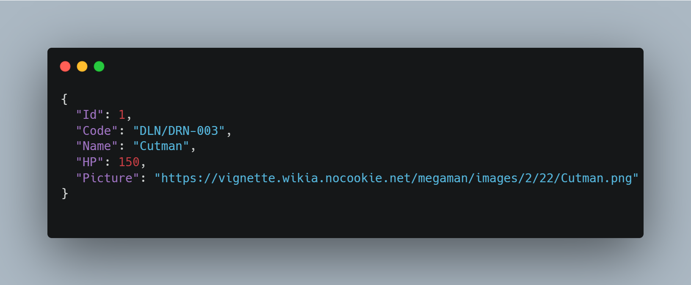

<h1 align="center">


 <b>  Megaman API </b> 


<h2 p align="center"> Visão Geral </h2 p>

<h4> 
Bem-vindo ao projeto Megaman API, um serviço desenvolvido em .NET Core 3.1 para gerenciar robôs do universo Megaman. Este projeto utiliza Entity Framework Core para manipulação de dados e segue um modelo de API RESTful.</h4>

## Informações do Robot de Exemplo





---
## Dependências
O projeto utiliza as seguintes dependências:

| Pacote | Versão | Link |
|--------|--------|------|
| Microsoft.EntityFrameworkCore | 3.1.8 | [Entity Framework Core](https://www.nuget.org/packages/Microsoft.EntityFrameworkCore/) |
| Microsoft.EntityFrameworkCore.Design | 3.1.8 | [Entity Framework Core Design](https://www.nuget.org/packages/Microsoft.EntityFrameworkCore.Design/) |
| Microsoft.EntityFrameworkCore.SqlServer | 3.1.8 | [Entity Framework Core SQL Server](https://www.nuget.org/packages/Microsoft.EntityFrameworkCore.SqlServer/) |
| Newtonsoft.Json | 12.0.2 | [Newtonsoft.Json](https://www.nuget.org/packages/Newtonsoft.Json/) |

---
## Endpoints

| Método | Rota | Descrição |
|--------|------|-----------|
| `GET` | `/api/v1/robots` | Retorna todos os robôs cadastrados. |
| `GET` | `/api/v1/robots/{id}` | Busca um robô pelo seu ID. |
| `POST` | `/api/v1/robots` | Cria um novo robô (atualmente sem implementação). |

---
## Estrutura do Projeto
A estrutura de diretórios do projeto segue o seguinte formato:


.vs
.vscode
bin
Controllers
Database
middlewares
Models
obj
Properties
Services
appsettings.Development.json
appsettings.json  
global.json
MegamanApi.csproj  
MegamanApi.sln
Program.cs
Startup.cs


---
## Técnicas Utilizadas
O projeto adota as seguintes técnicas:

- **Arquitetura em Camadas**: Separação da lógica de negócio, controllers e serviços.
- **Entity Framework Core**: ORM para comunicação com banco de dados SQL Server.
- **Injeção de Dependências**: Implementação do padrão de injeção de dependências para melhorar a testabilidade e modularidade.
- **API RESTful**: Seguindo boas práticas para criação de APIs.
- **Middleware**: Implementação de middlewares personalizados para tratamento de requisições.
- **Configuração baseada em arquivos JSON**: Uso dos arquivos `appsettings.json` e `appsettings.Development.json`.

---
## Configuração do Projeto
1. Certifique-se de ter o **.NET Core SDK 3.1** instalado.
2. Clone este repositório.
3. Restaure as dependências:
   ```sh
   dotnet restore
   ```
4. Execute a aplicação:
   ```sh
   dotnet run
   ```

Agora, a API estará disponível em `http://localhost:5000/api/v1/robots`.

---
## Licença
Este projeto é open-source e está disponível sob a licença MIT.

<h1>


